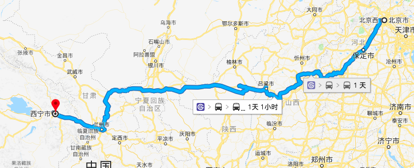

# 行程单

### 路线图

### 计划表

|  日期  |               路线               |  里程  |  住宿  |
:--: | :----------------------------: | :--: | :--:|
|  4   |            北京 — 西宁             | 1824 | 西宁|
|  5   |   西宁 — 塔尔寺— 倒淌河 — 青海湖 — 黑马河乡   | 248  | 黑马河乡|
|  6   |    黑马河乡 — 茶卡盐湖 — 托素湖 — 大柴旦     | 530  | 大柴旦镇 |
|  7   | 大柴旦 — 大柴旦湖 — 小柴旦湖 — 水上丹霞 —  冷湖 | 642  | 冷湖镇 |
|  8   |   冷湖 — 石油小镇 —  阳关 — 玉门关 — 敦煌   | 348  | 敦煌市 |
|  9   |  敦煌 — 月牙泉 —  鸣沙山 —  莫高窟 — 敦煌   |  51  | 敦煌市|
|  10  |        敦煌 — 玉门老城 — 嘉峪关         | 404  | 嘉峪关市 |
|  11  | 嘉峪关 — 悬壁长城 — 嘉峪关关城 —长城第一墩 — 酒泉 |  57  | 酒泉市|
|  12  |        酒泉 — 东风航天城 — 张掖         | 699  | 张掖市|
|  13  |        张掖丹霞 — 马蹄寺 — 门源         | 322  | 门源 |
|  14  |         门源 — 察汗河 — 西宁          | 156  | 西宁 |
|  15  |            西宁 — 北京             | 1824 | 北京 |

# Day 1

### 路线图

### 计划表

|         时间          |      行程       |  备注  |
| :-----------------: | :-----------: | :--: |
| 16：03 (-1)  — 14：16 | 乘坐 Z151 次前往西宁 |      |
|    14：16 — 14：45    |     火车站取车     |      |
|    14：45 — 15：15    |   前往东关清真大寺    |      |
|    15：15 — 16：45    |   参观东关清真大寺    |      |
|    17：00 — 18：30    |     西宁晚饭      |      |
|    18：30 — 20：30    |     西宁夜市      |      |
|        21：30        |      休息       |      |

**美食：**羊肠面、手抓肉、酿皮、仙红辣椒酱、白驼退骨馆  
***水井巷***、莫家街   
珠穆朗玛宾馆是班禅的行宫

# Day 2

### 路线图

### 计划表

|      时间       |            行程            |  备注   |
| :-----------: | :----------------------: | :---: |
|  7：00 — 7：30  |           西宁早饭           |       |
|  7：30 — 8：15  |      沿 S101 前往塔尔寺景区      |       |
| 8：30 — 11：30  |         塔尔寺景区游览          | 需要请讲解 |
| 11：30 — 12：15 |          湟中县午饭           |       |
| 12：15 — 13：30 | 经 X121/G214/G109 前往倒淌河景区 |       |
| 13：30 — 14：00 |         倒淌河景区游览          |       |
| 14：00 — 14：30 |    沿 G109 到达青海湖二郎剑景区     |       |
| 14：30 — 17：30 |        青海湖二郎剑景区游览        |       |
| 17：30 — 18：30 |      沿 G109 前往黑马河乡       |       |
| 18：30 — 19：00 |         办理入住，休息          |       |
| 19：00 — 20：30 |          黑马河乡晚饭          |       |
|     21：30     |            休息            |       |

# Day 3

### 路线图

### 计划表

|      时间       |           行程           |    备注     |
| :-----------: | :--------------------: | :-------: |
|  5：30 — 6：20  |          看日出           | 日出时间 6：00 |
|  6：20 — 8：00  |    沿 G109 前往茶卡盐湖景区     |   车上早饭    |
| 8：00 — 11：00  |        茶卡盐湖景区游览        |           |
| 11：00 — 12：00 |         茶卡镇午饭          |           |
| 12：00 — 15：50 |    沿 S2013 前往托素湖景区     |           |
| 15：50 — 16：20 |        托素湖景区游览         |           |
| 16：20 — 19：40 | 经 G315/S20/S314 前往大柴旦镇 |           |
| 19：40 — 20：40 |         大柴旦镇晚饭         |           |
|     21：30     |           休息           |           |

炕锅羊肉（伊布拉特色炕锅）

# Day 4

### 路线图

### 计划表

| 时间            | 行程                  | 备注   |
| ------------- | ------------------- | ---- |
| 7：00 — 7：30   | 前往大柴旦湖景区            | 车上早饭 |
| 7：30 — 8：00   | 大柴旦湖景区游览            |      |
| 8：00 — 8：50   | 经 G3011/G315 前往小柴旦湖 |      |
| 8：50 — 9：20   | 小柴旦湖游览              |      |
| 9：20 — 11：30  | 沿 G315 前往水上雅丹       |      |
| 11：30 — 12：00 | 经 G305/S305 到达冷湖镇   |      |
| 12：00 — 14：00 | 水上雅丹景区游览            |      |
| 14：00 — 18：30 | 沿 G315/S305 前往冷湖镇   |      |
| 18：30 — 19：30 | 冷湖镇晚饭               |      |
| 21：30         | 休息                  |      |

# Day 5

### 路线图

### 计划表

|      时间       |           行程            |  备注  |
| :-----------: | :---------------------: | :--: |
|  7：00 — 9：30  | 经 S305/G215/X281前往博罗转井镇 |      |
| 9：30 — 10：30  |        阿克塞石油小镇游览        |      |
| 10：30 — 12：00 |   经 X281/G215 前往阳关景区    |      |
| 12：00 — 13：00 |         阳关景区午饭          |      |
| 13：00 — 15：00 |         阳关景区游览          |      |
| 15：00 — 16：00 |     沿 S303 前往玉门关景区      |      |
| 16：00 — 17：30 |         玉门关景区游览         |      |
| 17：30 — 19：00 |    经 S303/G215 前往敦煌     |      |
| 19：00 — 20：00 |          敦煌晚饭           |      |
| 20：00 — 21：00 |         敦煌夜市游览          |      |
|     21：30     |           休息            |      |

驴肉黄面、杏皮水、浆水面、鸣山大枣  
靖远美味羊羔肉  
敦煌夜市风评一般，可到时视情况在周边解决吃饭问题

# Day 6

### 路线图

### 计划表

|      时间       |      行程      |  备注  |
| :-----------: | :----------: | :--: |
|  7：00 — 7：30  |     敦煌早饭     |      |
|  7：30 — 8：00  | 沿 阳光大道 前往莫高窟 |      |
| 8：00 — 12：00  |    莫高窟游览     |      |
| 12：00 — 13：00 |    莫高窟午饭     |      |
| 13：00 — 17：00 |   鸣沙山月牙泉游览   |      |
| 17：00 — 18：00 | 沿 阳光大道 前往莫高窟 |      |
| 18：00 — 19：30 |     敦煌晚饭     |      |
| 19：30 — 21：00 |    沙洲夜市游览    |      |
|     21：30     |      休息      |      |

# Day 7

### 路线图

### 计划表

|      时间       |          行程          |  备注  |
| :-----------: | :------------------: | :--: |
|  7：00 — 8：00  |         敦煌早饭         |      |
| 8：00 — 11：50  | 经 G3011/G312 前往玉门老君庙 |      |
| 11：50 — 13：00 |       玉门老君庙午饭        |      |
| 13：00 — 16：00 |       玉门老君庙游览        |      |
| 16：00 — 17：20 |   经 S215/G30 前往嘉峪关   |      |
| 17：20 — 18：00 |          休息          |      |
| 18：00 — 19：30 |        嘉峪关晚饭         |      |
| 19：30 — 20：30 |       嘉峪关市区游览        |      |
|     21：30     |          休息          |      |
沙葱、沙枣  
大唐美食街

# Day 8

### 路线图

### 计划表

|      时间       |         行程          |  备注  |
| :-----------: | :-----------------: | :--: |
|  7：00 — 7：30  |        嘉峪关早饭        |      |
|  7：30 — 8：00  | 经 阳关路/X307 前往悬壁长城景区 |      |
| 8：00 — 11：00  |      悬壁长城景区游览       |      |
| 11：00 — 11：30 |  经 X307/阳关路 前往嘉峪关   |      |
| 11：30 — 13：00 |        嘉峪关午饭        |      |
| 13：00 — 14：30 |        嘉峪关关城        |      |
| 14：30 — 15：30 |        长城第一墩        |      |
| 15：30 — 16：30 |     沿 G30 前往酒泉市     |      |
| 16：30 — 17：30 |         休息          |      |
| 17：30 — 19：00 |        酒泉市晚饭        |      |
| 19：00 — 20：30 |        酒泉市散步        |      |
|     21：30     |         休息          |      |

***肃州区早餐 糊锅***

# Day 9

### 路线图

### 计划表

|      时间       |        行程         |  备注  |
| :-----------: | :---------------: | :--: |
| 7：00 — 11：00  | 经 酒航路/航天路 前往东风航天城 | 车上早饭 |
| 11：00 — 14：00 |      东风航天城游览      |      |
| 14：00 — 20：00 |  经 酒航路/G30 前往张掖市  | 车上午饭 |
| 20：00 — 21：00 |       张掖市晚饭       |      |
|     21：30     |        休息         |      |

张掖臊面（早饭）、卷子鸡

# Day 10

### 路线图

### 计划表

|      时间       |         行程         |  备注  |
| :-----------: | :----------------: | :--: |
|  7：00 — 7：30  |       张掖市早饭        |      |
|  7：30 — 8：30  | 沿 S213 前往 七彩丹霞地质公园 |      |
|  8：30 —12：30  |     七彩丹霞地质公园游览     | 路上午饭 |
| 12：30 — 14：30 | 经 S213/X213 前往马蹄寺  |      |
| 14：30 — 16：30 |       马蹄寺游览        |      |
| 16：30 — 20：00 |  经 X213/西张线 前往门源   |      |
| 20：00 — 21：00 |        门源晚饭        |      |
|     21：30     |         休息         |      |

# Day 11

### 路线图

### 计划表

|      时间       |        行程        |  备注  |
| :-----------: | :--------------: | :--: |
|  7：00 — 7：30  |       门源早饭       |      |
|  7：30 — 8：30  | 沿 岗大公路 前往察汗河森林公园 |      |
| 8：30 — 16：30  |    察汗河森林公园游览     |      |
| 16：30 — 18：00 | 沿 西张线/G227 前往西宁  |      |
| 18：00 — 19：30 |       西宁晚饭       |      |
| 19：30 — 21：00 |      西宁夜市游览      |      |
|     21：30     |        休息        |      |

# Day 12

### 路线图

### 计划表

|        时间         |      行程      |  备注  |
| :---------------: | :----------: | :--: |
|    8：00 — 8：30    |     西宁早饭     |      |
|    8：30 — 9：00    |   前往青海省博物馆   |      |
|   9：00 — 12：00    |   参观青海省博物馆   |      |
|   12：00 — 12：30   |   前往西宁火车站    |      |
|   12：30 — 13：35   |     西宁午饭     |      |
| 13：35 — 8：28 (+1) | 乘坐 Z22 次返回北京 |      |

